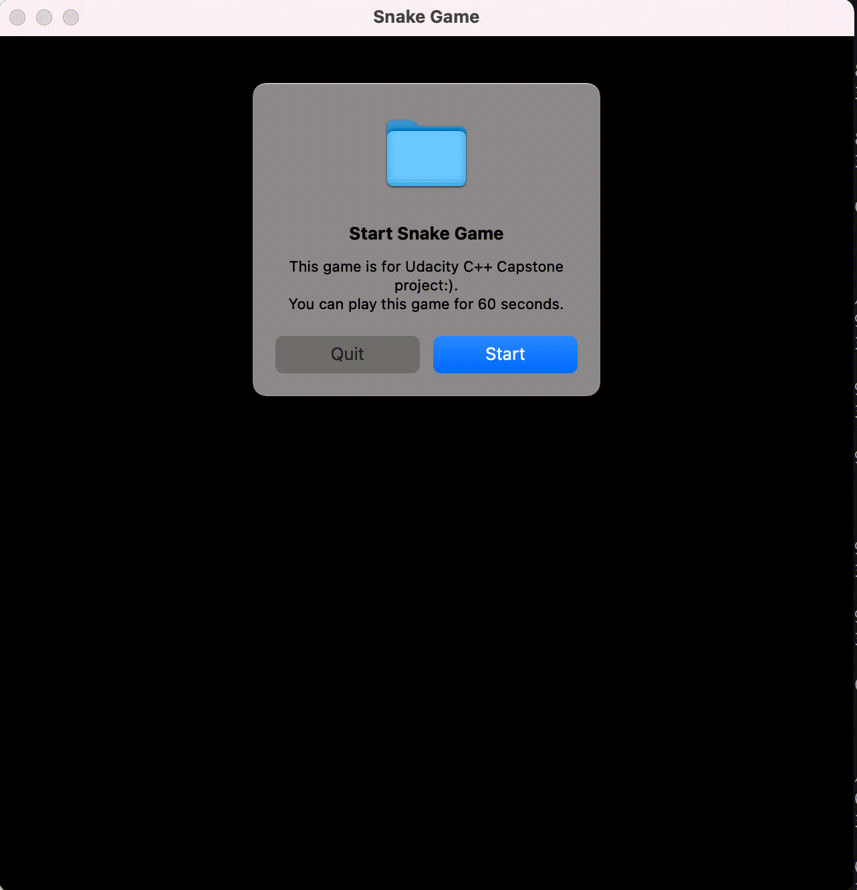

# CPPND: Capstone Snake Game

This is the repo for the Capstone project in the [Udacity C++ Nanodegree Program](https://www.udacity.com/course/c-plus-plus-nanodegree--nd213). The code for this repo was inspired by [this](https://codereview.stackexchange.com/questions/212296/snake-game-in-c-with-sdl) excellent StackOverflow post and set of responses.



In this project, I extended [Snake game sample code](https://github.com/udacity/CppND-Capstone-Snake-Game) with below additional features to show you what I have learned throughout this course. As for rubric criteria, see [here](#rubric-criteria).

## New Features
- Start Message
  - You will see the start message at the beginning of the game. You can choose `Start` or `Quit`.
- Pause
  - You can pause/resume the game by pressing SPACE button.
- Obstacle
  - You will see one gray obstacle. If the snake hits this obstacle, it will die.
- Gameover Message
  - You will see the gameover message if the snake hits an obstacle. You can choose `Continue` or `Quit`.
- BGM
  - The music will be played during gameplay. I got wav file from [here](https://maoudamashii.jokersounds.com/list/bgm11.html).
- Countdown Timer
  - You can play this game only for 60 seconds. You will see the countdown timer in the top left corner of the screen.

## Project Directory Structure

```
% tree
.
├── CMakeLists.txt
├── README.md
├── cmake
│   ├── FindSDL2_image.cmake
│   ├── FindSDL2_mixer.cmake
│   └── FindSDL2_ttf.cmake
├── music
│   └── bgm_maoudamashii_8bit07.wav
├── snake_game_on_mac.gif
├── src
│   ├── bgm.cpp
│   ├── bgm.h
│   ├── controller.cpp
│   ├── controller.h
│   ├── game.cpp
│   ├── game.h
│   ├── main.cpp
│   ├── messagebox.cpp
│   ├── messagebox.h
│   ├── renderer.cpp
│   ├── renderer.h
│   ├── snake.cpp
│   └── snake.h
└── ttf
    └── OpenSans-Regular.ttf
```

## Dependencies for Running Locally
* cmake >= 3.7
  * All OSes: [click here for installation instructions](https://cmake.org/install/)
* make >= 4.1 (Linux, Mac), 3.81 (Windows)
  * Linux: make is installed by default on most Linux distros
  * Mac: [install Xcode command line tools to get make](https://developer.apple.com/xcode/features/)
  * Windows: [Click here for installation instructions](http://gnuwin32.sourceforge.net/packages/make.htm)
* SDL2 >= 2.0
  * All installation instructions can be found [here](https://wiki.libsdl.org/Installation)
  * Note that for Linux, an `apt` or `apt-get` installation is preferred to building from source.
  `apt install -y libsdl2-dev libsdl2-image-dev libsdl2-ttf-dev libsdl2-mixer-dev`
  * Note that for Mac, you can use [Homebrew](https://brew.sh/) to install SDL2 packages.
  `brew install sdl2 sdl2_image sdl2_ttf sdl2_mixer`
* gcc/g++ >= 5.4
  * Linux: gcc / g++ is installed by default on most Linux distros
  * Mac: same deal as make - [install Xcode command line tools](https://developer.apple.com/xcode/features/)
  * Windows: recommend using [MinGW](http://www.mingw.org/)

## Build Instructions

1. Clone this repo.
2. Make a build directory in the top level directory: `mkdir build && cd build`
3. Compile: `cmake .. && make`
4. Run it: `./SnakeGame`.

## Rubic Criteria
I believe that I met at least the following 6 criteria.

### Loops, Functions, I/O
- The project demonstrates an understanding of C++ functions and control structures.
  - For example, in main.cpp, I used `stringstream` to operate strings and created `GetCurrentTime` and `WriteHistory` function to organize the project codes clearly.

- The project reads data from a file and process the data, or the program writes data to a file.
  - In main.cpp, you can save 1 play history (time, score, snake size) to history.txt by `WriteHistory` function.

### Object Oriented Programming
- The project uses Object Oriented Programming techniques.
  - I created MessageBox class and Bgm class with various methods. It is intended to improve code maintainability by clarifying the role of each class.

- Classes encapsulate behavior.
  - In Controller class, I created getter method, `IsPaused()`, for provate value, `paused`.

### Memory Management
- The project makes use of references in function declarations.
  - For example, in Game class, I added new bgm and messagebox variables to `Run` method as reference passes.

### Concurrency
- The project uses multithreading.
  - In game.cpp, I used multithread to run the countdown timer asynchronously. Please check `Run` method.